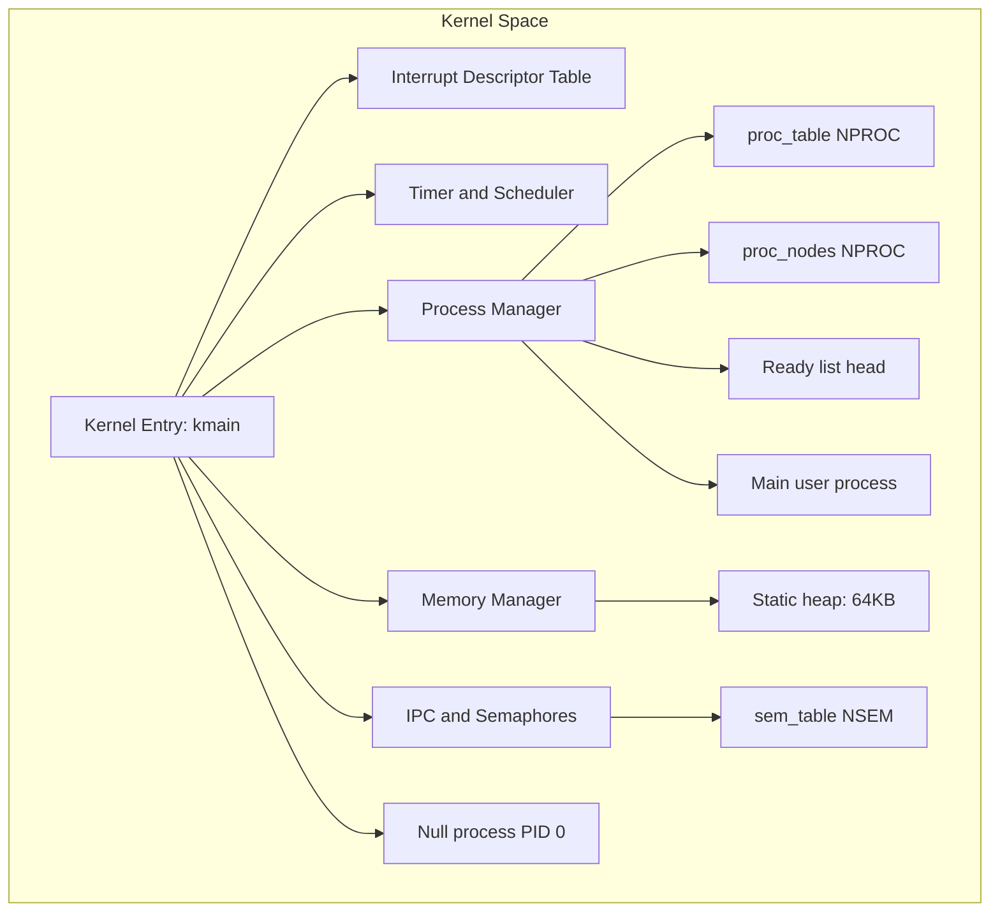
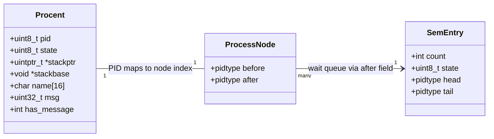
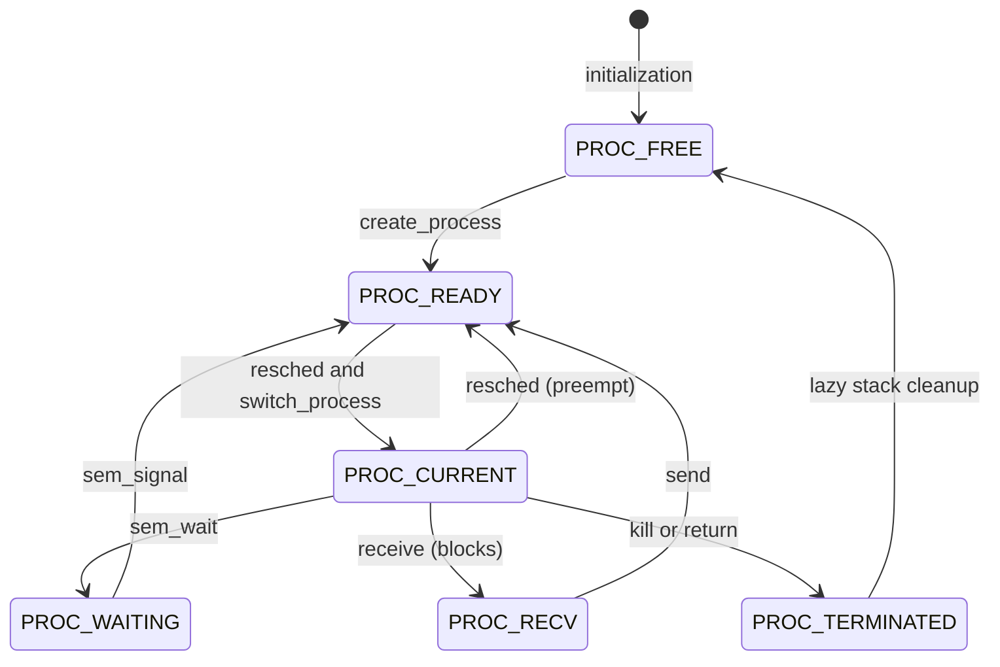
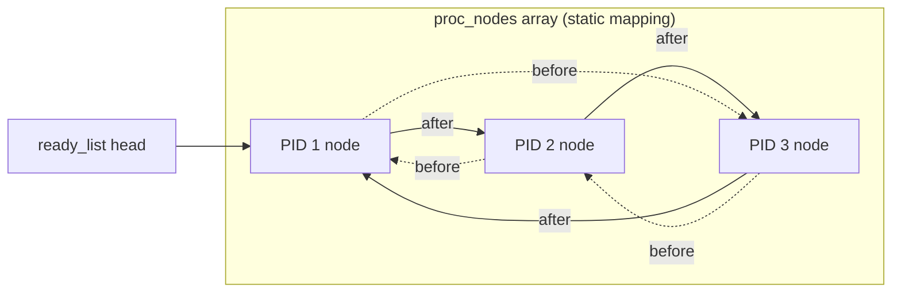
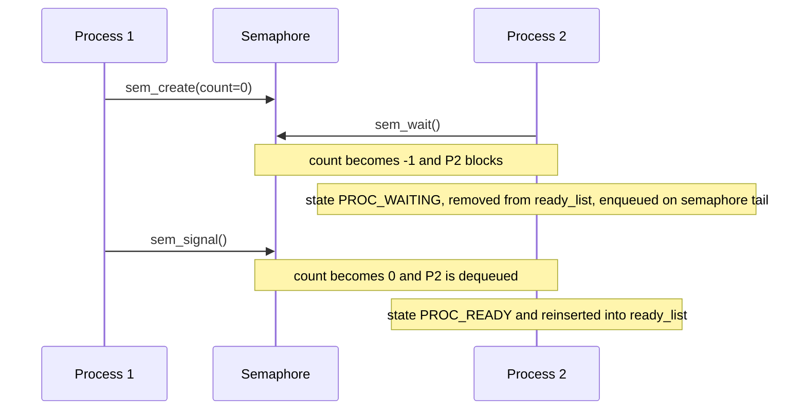

# kacchiOS - Project Report

## Project Team
| Name | Student ID | Role |
| :--- | :---: | :--- |
| Md. Rraf Hasan | 2103062 | Contributor |
| Motuir Rahman Sany | 2103086 | Contributor |
| Irfan Hossain Bhuiyan | 2103088 | Head Contributor |
| Hasan Al Mahadi | 2103092 | Contributor |
| Rafi Ahmed | 2103093 | Contributor |
| Arif Foysal Bin Haider | 2103119 | Contributor |

## 1. Abstract
**kacchiOS** is a minimalist operating system heavily inspired by the design principles of Xinu OS. The core philosophy driving its architecture is the absolute avoidance of dynamic, heap-allocated data structures for critical system operations (such as scheduling queues or priority heaps). Instead, every process and its metadata are treated as statically allocated nodes. The linkages between processes are achieved purely through relative indexing (process IDs), enabling $O(1)$ state transitions, IPC, and scheduling operations without the overhead, unpredictability, or fragmentation risks of dynamic memory management.Everything is run in kernal mode.This is a os popular for it's simplicity.

## 2. Core Architecture & Design Philosophy
The kernel rigidly avoids `malloc()` and `free()` when managing underlying resource pools like ready queues, semaphore waiting lists, or IPC message buffers.
1. **Static Pre-allocation**: Process tables and semaphore arrays are allocated in static memory (`proc_table[NPROC]`, `sem_table[NSEM]`).
2. **Index-Based Linked Lists**: Instead of pointers, systems relying on queues use fixed indices. For example, the `ProcessNode` struct maintains `before` and `after` `pidtype` values to create a doubly-linked circular list without pointer dereferencing or runtime allocation.
3. **Array-backed Node Graphs**: A process transitions between different lists (e.g., from the `ready_list` to a semaphore's wait-list) simply by unlinking and relinking its `before` and `after` indices in the global `proc_nodes` array.

### System Architecture Overview

**Note:** In kacchiOS, there is no true separation between user space and kernel space. All code, including what would traditionally be considered "user" processes, runs in kernel space with full privileges. This means every process, including the main user process and the null process, executes in the same address space and privilege level as the kernel itself. This design simplifies context switching and resource management but also means there is no hardware-enforced protection between processes and the kernel.

**Explanation:**
- All processes, including the main user process, are managed as kernel threads.
- There is no hardware-enforced memory or privilege separation.
- This design is typical for minimalist or educational OS projects, and it allows for simpler implementation and debugging at the cost of security and robustness.

## 3. Boot and Initialization Process
The boot process of kacchiOS is designed to be minimal yet robust, transitioning the system from a raw hardware state into a fully functioning multitasking environment.

1. **Bootloader Handoff**: The system is booted via a standard multiboot-compliant bootloader (like GRUB), which loads the kernel into memory and jumps to the entry point.
2. **Kernel Entry (`kmain`)**: The `kmain` function is the first C code executed. It is responsible for initializing all core subsystems.
3. **Interrupt Descriptor Table (IDT) Setup**: The IDT is initialized early to handle hardware interrupts and CPU exceptions. This is crucial for system stability and preemptive scheduling.
4. **Subsystem Initialization**:
   - **Memory Manager**: The static heap array is initialized, setting up the initial free block.
   - **Process Manager**: The `proc_table` and `proc_nodes` arrays are zeroed out. The `ready_list` is initialized as an empty circular list.
   - **IPC & Semaphores**: The `sem_table` is initialized, marking all semaphores as free.
5. **Null Process Creation**: The first process created is the `null_process` (PID 0). This process runs an infinite loop (`while(1) { hlt; }`) and ensures the CPU always has something to execute when no other processes are ready.
6. **Main User Process**: The `main` process is created, which serves as the entry point for user-defined logic.
7. **Scheduler Activation**: Finally, the timer interrupt is enabled, and the scheduler takes over, preempting the initialization code and switching to the first ready process.

## 4. Process Management & Scheduling
At the heart of the operating system is the **Process Table** (`proc_table`) and the **Process Node Graph** (`proc_nodes`). The scheduler follows a preemptive **Round-Robin** policy (default quantum: 20ms). Context switching leverages inline assembly to save general-purpose registers (`popa`/`pusha`), `ESP`, and CPU Flags (`EFLAGS`).

### Process Data Structures

### Process State Transitions

### Core Process Operations
To ensure the evaluator can understand the project without looking at the code, here is a detailed breakdown of the core process management functions:

- **`create_process(void *func, uint32_t stack_size, char *name)`**: 
  - Scans the `proc_table` for a `PROC_FREE` slot.
  - Allocates a stack using `alloc_stack(stack_size)`.
  - Initializes the process's stack frame to simulate an interrupt return. It pushes the initial `EFLAGS`, `CS`, `EIP` (pointing to `func`), and general-purpose registers onto the stack.
  - Sets the process state to `PROC_READY` and inserts it into the `ready_list` using the `proc_nodes` array.
  - Returns the newly assigned PID.

- **`reshed()` (Reschedule)**:
  - The core of the preemptive scheduler. It is called by the timer interrupt handler or voluntarily by processes (e.g., when blocking).
  - If the current process is still `PROC_CURRENT`, its state is changed back to `PROC_READY`.
  - The scheduler traverses the `ready_list` to find the next `PROC_READY` process.
  - It updates the `current_pid` and calls `switch_process()` to perform the context switch.

- **`switch_process(uintptr_t **old_sp, uintptr_t *new_sp)`**:
  - An assembly-level function that saves the current CPU context (registers) onto the current process's stack.
  - It saves the current stack pointer (`ESP`) into `old_sp`.
  - It loads the new stack pointer from `new_sp`.
  - It restores the CPU context from the new process's stack and executes an `iret` (or `ret`) to resume execution.

- **`kill(pidtype pid)`**:
  - Marks the specified process's state as `PROC_TERMINATED`.
  - Removes the process from the `ready_list` or any semaphore wait-list it might be on.
  - The actual stack memory is not freed immediately. Instead, a lazy garbage collection approach is used: the scheduler will free the stack when it encounters the `PROC_TERMINATED` process during its next traversal.

### The "Dynamic-less" Scheduler Queue
The `ready_list` utilizes the `proc_nodes` parallel array to build an infinitely iterable circular doubly-linked list.

*Because nodes physically reside in an array, traversing `ready_list` consumes exactly zero `malloc` cycles.*

## 5. Inter-Process Communication (IPC)

### Message Passing
A localized, 32-bit IPC message passing interface allows strict synchronicity:
- `send(pid, msg)`: Non-blocking. Attempts to deliver `msg` directly to the destination process's struct. Since `kacchiOS` avoids buffers, if the recipient already holds an unread message, `send` safely aborts (queue full). If the destination is blocked (`PROC_RECV`), it is awakened (`PROC_READY`) and restored to the ready list dynamically.
- `receive()`: Blocking. Consumes and returns a pending message. If none exists (`has_message == 0`), the calling process puts itself into `PROC_RECV` and safely invokes `reshed()`.

### Message Passing Mechanics
To ensure the evaluator can understand the project without looking at the code, here is a detailed breakdown of the core IPC functions:

- **`send(pidtype pid, uint32_t msg)`**: 
  - Checks if the target process is valid and if it already has an unread message (`has_message == 1`). If so, it returns an error (queue full).
  - Copies the `msg` into the target process's `msg` field and sets `has_message = 1`.
  - If the target process is in the `PROC_RECV` state (blocked waiting for a message), its state is changed to `PROC_READY`, and it is re-inserted into the `ready_list`.

- **`receive()`**: 
  - Checks if the current process has an unread message.
  - If `has_message == 0`, the process changes its state to `PROC_RECV` and calls `reshed()` to block until a message arrives.
  - Once a message is available, it reads the `msg` field, sets `has_message = 0`, and returns the message.

### Semaphores
True to the OS philosophy, Semaphore queues (blocked process lists) avoid allocations. They leverage the isolated `.after` field inside the `proc_nodes` array to establish isolated singly-linked FIFO queues for waiting entities.

### Semaphore Mechanics
- **`sem_create(int count)`**: Scans the `sem_table` for a free slot, initializes its count, and returns the semaphore ID.
- **`sem_wait(int sem_id)`**: 
  - Decrements the semaphore's count.
  - If the count becomes less than 0, the current process changes its state to `PROC_WAITING`.
  - The process is removed from the `ready_list` and appended to the semaphore's wait-list (using the `head` and `tail` indices in the `sem_table` and the `after` field in `proc_nodes`).
  - Calls `reshed()` to block.
- **`sem_signal(int sem_id)`**: 
  - Increments the semaphore's count.
  - If the count is less than or equal to 0, it means there are processes waiting.
  - It dequeues the first process from the semaphore's wait-list, changes its state to `PROC_READY`, and re-inserts it into the `ready_list`.

## 6. Memory Management
While kernel architectural structures strictly abstain from utilizing it, a memory API exists for auxiliary needs and User space allocations:
- **Stack Allocation**: `alloc_stack(size)` ensures rigid runtime safety boundaries per process. Stacks are lazily pruned by the scheduler when `switch_to_next_process` detects and passes over a `PROC_TERMINATED` entity.
- **Heap Allocation (`malloc` / `free`)**: Mapped across a dedicated `uint8_t heap_memory[64 * 1024]` region.
  - Implements a simplistic **First-Fit** traversal. 
  - Resolves metadata storage gracefully using hidden 16-byte aligned `BlockHeader` structures before each payload block. 
  - Implements implicit localized structural coalescing automatically on each `free()` cycle to prevent memory fragmentation.

### Memory Operations Breakdown
To ensure the evaluator can understand the project without looking at the code, here is a detailed breakdown of the core memory functions:

- **`alloc_stack(uint32_t size)`**: 
  - Calls `malloc(size)` to allocate memory for a process stack.
  - Returns a pointer to the *top* of the allocated memory block (since stacks grow downwards on x86).
- **`malloc(uint32_t size)`**: 
  - Traverses the static `heap_memory` array looking for a free block large enough to satisfy the request (First-Fit).
  - If a block is larger than needed, it splits the block, creating a new free block from the remainder.
  - Marks the allocated block as used and returns a pointer to the payload.
- **`free(void *ptr)`**: 
  - Marks the block associated with `ptr` as free.
  - Scans the heap to merge adjacent free blocks (coalescing) to prevent fragmentation.

## 7. Implementation Checklist & Status Overview

| Category | Feature | Status | Notes |
| :--- | :--- | :---: | :--- |
| **Memory Manager** | Stack allocation | ✔ | Automatically managed on spawn. |
| | Heap allocation | ✔ | First-Fit approach. |
| | Stack deallocation | ✔ | Cleaned lazily by RR scheduler. |
| | Heap deallocation | ✔ | Supports aggressive coalescing. |
| | Optimized allocation | ✔ | Debatable metrics. Minimal overhead. |
| **Process Manager** | Process table | ✔ | Static allocation via `NPROC`. |
| | Process creation | ✔ | Handled explicitly via `create_process`. |
| | State transition | ✔ | Safely protected by `cli`/`sti` guards. |
| | Process termination | ✔ | Features `kill()` and graceful returns. |
| | Utility functions | ✔ | `getpid()`, node retrieval macros. |
| | Add more states | ✔ | Supports Wait and Recv semantics. |
| | Inter-process Comm | ✔ | Semaphores & Direct MSGs built. |
| **Scheduler** | Clear Scheduling Policy | ✔ | Implements Preemptive Round-Robin. |
| | Context switch | ✔ | Inline Assembly Context saving. |
| | Configurable quantum | ✔ | Set to legacy 20ms defaults via Timer. |
| | Implement aging | ❌ | Future Milestone Target. |

## 8. Development Challenges & Reflections

### Debugging Experience: Interrupts, Loops, and Frustration
During the development of kacchiOS, I encountered a severe and persistent issue where the OS would appear to loop endlessly or reboot itself immediately after booting. After exhausting hours of debugging, I discovered the root cause: I had not set up the Interrupt Descriptor Table (IDT) or any interrupt handlers. 

Because kacchiOS is a freestanding binary, I assumed that since I was not explicitly calling any standard library functions that use interrupts, and since I hadn't implemented a second interrupt handler yet, I didn't need to set up the IDT right away. I thought I could defer it until I needed to handle timer ticks or keyboard input.

However, this assumption was fundamentally flawed. The compiler, when applying optimizations, utilized SIMD (Single Instruction, Multiple Data) instructions for certain operations. These instructions, or other unexpected CPU exceptions (like a division by zero or an invalid opcode), trigger hardware interrupts. 

Without a valid IDT, when the CPU encountered one of these faults, it couldn't find an interrupt handler. This led to a double fault, and since there was no handler for that either, it resulted in a **triple fault**. In the x86 architecture, a triple fault causes the processor to immediately reset and reboot. This rapid reboot cycle made it look like the code was stuck in an infinite loop.

This was an incredibly confusing and frustrating experience. I was getting a loop in my code even though I wasn't calling any interrupts! It taught me a hard lesson about how compiler optimizations can introduce unexpected behavior in a freestanding environment.

**Key lesson:** In OS development, it is always preferable to set up the IDT first. Even if you think you don't need to implement interrupt handlers yet, you must set up a basic IDT with dummy handlers to catch unexpected faults. Compiler optimizations and hardware behavior will create problems if the core infrastructure is not in place.

### Personal Reflection
This project taught me that OS development is full of subtle traps and unexpected interactions between hardware, the compiler, and the code. The lack of user/kernel space separation made debugging easier in some ways, but also meant that any bug could crash the entire system. My main frustration was with the invisible ways the compiler can introduce dependencies on features (like interrupts) that I had not planned for. I now appreciate the importance of setting up core infrastructure early, and I highly recommend future OS developers do the same.

## 9. Conclusions
The current state of **kacchiOS** proves that constructing an IPC-compliant, Semaphore-oriented preemptive multitasker does not strictly mandate dynamic memory operations within the core kernel loop space. Using node arrays successfully scales minimal-overhead context swaps, avoiding erratic heap faults and minimizing logical execution complexity. The corrupted unit tests can be rectified in future revisions to align structurally with the `PROC_FREE` zombie garbage collection and the index-based semaphore enqueueing semantics introduced in this milestone design.

